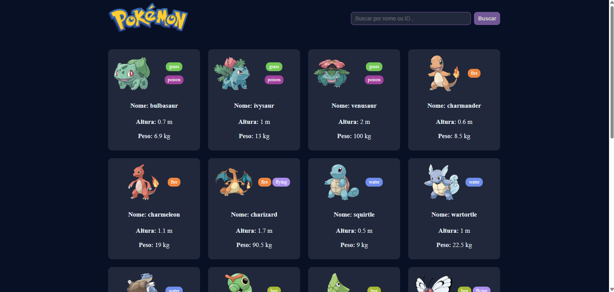
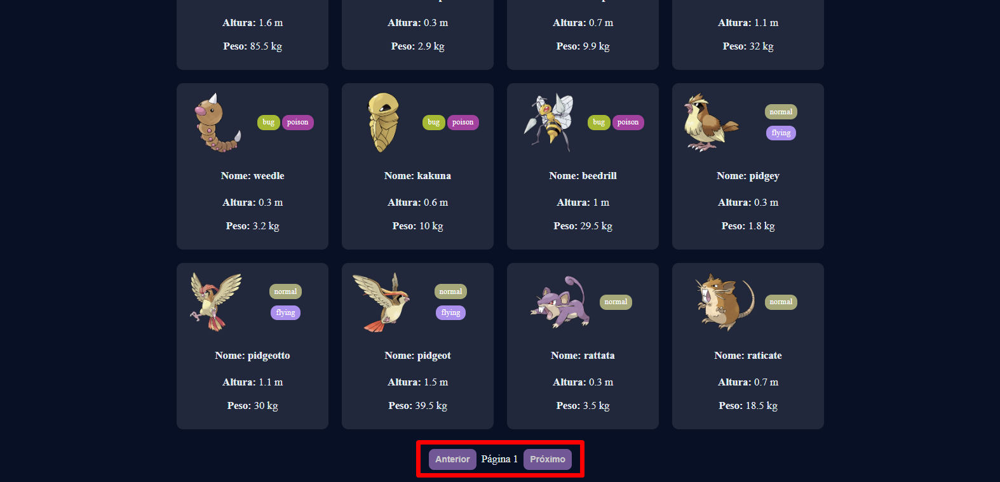
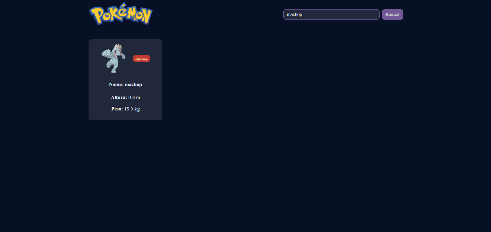
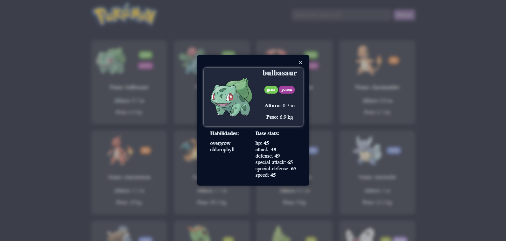

# Pokemon

Aplicação web que consome a PokéAPI para buscar e listar pokemons.
Desenvolvido como parte do Desafio PDM.

---

## Funcionalidades implementadas

### Nível 1 — Busca Básica
- Buscar pokémon por **nome ou ID**
- Exibir **imagem**, **altura**, **peso** e **tipos**
- Exibir **loader** durante a busca
- Mensagem de erro quando o pokémon não existe

### Nível 2 — Listagem com Paginação
- Lista de 20 pokémons por página
- Botões **Anterior / Próximo**
- Cards clicáveis
- Layout responsivo (4 colunas desktop, 1 mobile)
- Indicação da página atual

---

## Como Rodar o Projeto

### Opção 1 — Abrir Diretamente
1. Baixe ou clone o repositório:
   git clone https://github.com/rmaiasjr/mercos-pokemon.git

2. Abra o arquivo index.html no navegador.

3. Acesse a URL https://rmaiasjr.github.io/mercos-pokemon/

---

## Dificuldades encontradas
- Estilização com CSS puro
- Não recordar reucrsos JS

---

## Screenshots

### Lista de porkemons

### Paginação

### Pesquisa

### Detalhe do pokemon

